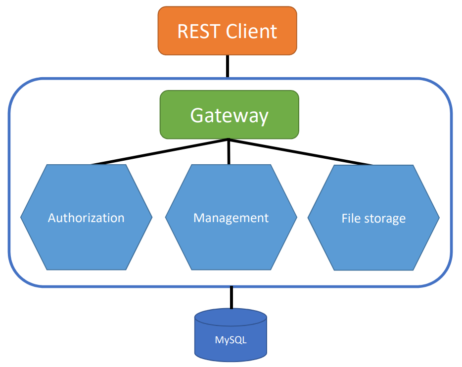

# File Storage Manage Backend Service

This project is a backend service for managing file storage and permission, consisting of multiple APIs and a MySQL database. It uses Docker and Docker Compose to orchestrate the containers.

## Description

The File Storage Manage Backend Service provides APIs for authentication, managing files, and interacting with a MySQL database. It allows users to authenticate, upload and download files, and perform various file management operations.

The project consists of the following components:
- Auth API: Handles user authentication and authorization.
- Manage API: Provides endpoints for managing files and interacting with the database.
- File Storage API: Handles file storage and retrieval.
- MySQL Database: Stores user and file metadata.



## Prerequisites

List any prerequisites or dependencies required to run the project, such as Docker and Docker Compose. Provide installation instructions or links to relevant resources.

## Getting Started

### Pre-install prerequisites

### Installation

1. Clone the repository:

   ```shell
   git clone https://github.com/ncugit-sec/StorageManage.git
   ```
2. Change into the project directory:
    ```shell
    cd StorageManage
    ```
3. Customize Configuration:
    Update configuration files as per your requirements. Refer to the individual component documentation for configuration options. Prepare the .env files using .env.example
4. Start the Containers:
    ```shell
    docker-compose up -d --build
    ```
    This command will build the Docker images and start the containers in detached mode.

## Usage

- Auth API: Access the authentication API at http://localhost/auth/.
- Manage API: Access the management API at http://localhost/manage/.
- File Storage API: Access the file storage API at http://localhost/file/.
- MySQL Database: The MySQL database is accessible at localhost with the configured credentials.


## Documentation

API documentation for each endpoint is available at the following URLs:
- END_POINT_BASE_URL/swagger/
- END_POINT_BASE_URL/redoc/

To access the API documentation, open your web browser and navigate to the corresponding URL for the desired API endpoint. The documentation will provide detailed information about the available endpoints, request/response formats, and any additional documentation specific to each API.

## TODO
- TestCase
- Deployment